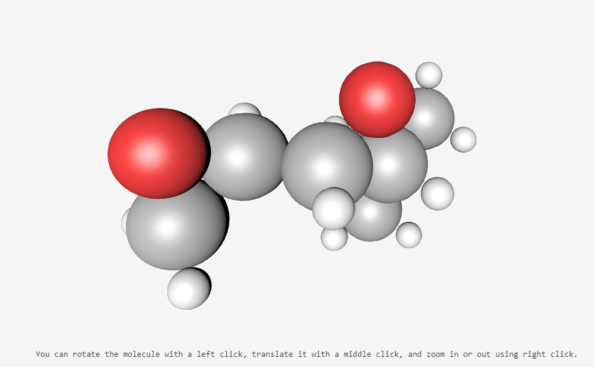
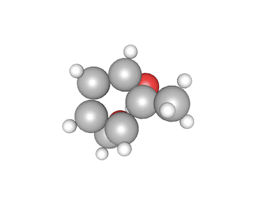

## 1.  [ase-visualization-of-molecules.ipynb](ase-visualization-of-molecules.ipynb)
---
Package ase is prepared for 3D Visualization of Molecules. Package to do that is available on gitlab: [ase ](https://gitlab.com/ase/ase).

* Library needs two tables one is where atoms have their coordinates x,y,z and another coresponding with keys=symbols.
* It could be just four columns in table csv, or pandas with columns x,y,x, symbol.

 

---
## 2.  [Keras-neural-net-for-champs.ipynb ](Keras-neural-net-for-champs.ipynb)

Task here is 
*  predicting the scalar_coupling_constant between atom pairs in molecules, given the two atom types (e.g., C and H),
 the coupling type (e.g., 2JHC), and any features you are able to create from the molecule structure (xyz) files

---

## 3.  [wiki_download.ipynb ](wiki_download.ipynb)

For diifferent NLP or GPT models and task input is the data.
One of the sources of the data is wikipedia. Based on collected and processed data from wikipedia at the end there is a txt file,
in  this particualr case plwiki is being collected to be able further train non english tokenizer and GPT 2 model

---
## 4.  [max_size_occup.py ](max_size_occup.py)

* Automatically  delete oldest files from given folder and keep used capacity within given limit
on the   Raspberry Pi.  
I've  tried to find as simple as possible  functions and use them.
   
It looks like os and glob libraries are doing their job and are able to handle easiest way everything.   
   
There are only two simple functions:
>* _sorted_dir_list()_    which is creating sorted list with given folder as input
>* _to_big_delete_oldest(40)_   function which  delete oldest files up to given limit( capacity in GB) with given granularity here 100 files  

executing is simple:   $ _python max_size_occup.py_

  
  Of course the libraries pathlib and glob should be installed before if necessary. To be able to do it automatically there is need  to do  execution through 
[CRONTAB](https://linuxhandbook.com/crontab/) so cleanup will be done periodically as defined by user 
#

## 5.  [olx-table.ipynb ](olx-table.ipynb)

Task here was 
*   to scrap the webpage  where main structure was based on the table structure.
Information after cleaning with some simple REGEX was saved  as pandas databse for later comparison and use.

## 5.  [data science  with docker](aa.jpg)
To extend cpabilities of docker container is sometimes required update some internal packages or install something neww.
That was the case this time. There was need to add ffmpeg inside as getting information about the media files through ffprobe 
was not easy.
Steps e

## Technologies

_Created by:_ [@len-sla]

